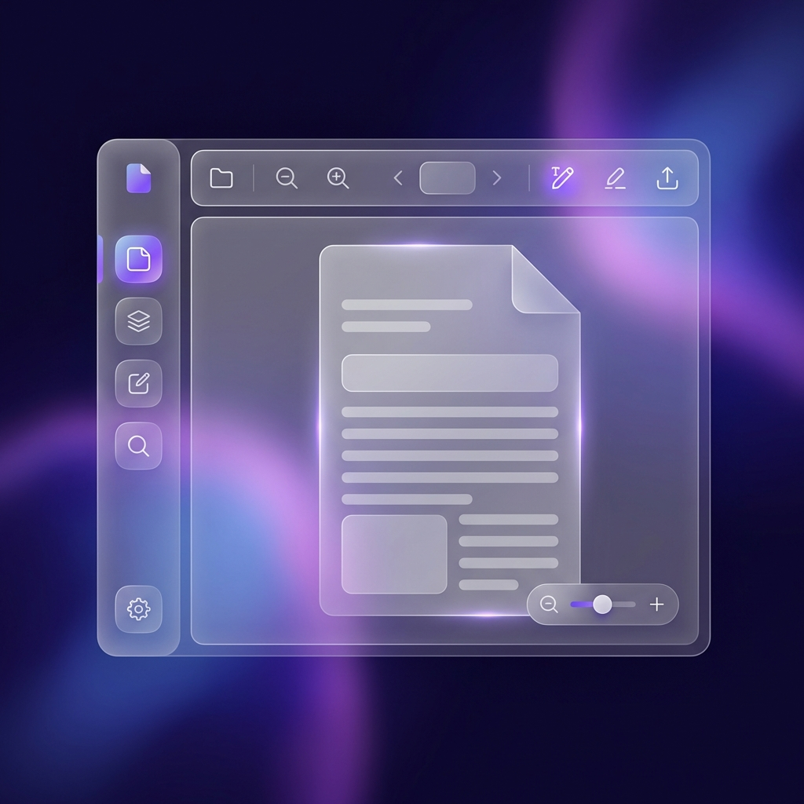

# Abuzar Wahadatullah Sayyed - Full Stack Developer Portfolio

This is the personal portfolio website for **Abuzar Wahadatullah Sayyed**, a Full Stack Developer specializing in modern web technologies and mobile application development.

## 🚀 Features

-   **Modern Tech Stack**: Built with Next.js 15, React 19, and Tailwind CSS v4.
-   **Light Theme Focus**: Optimized for a clean, professional light-mode aesthetic.
-   **Responsive Design**: Optimized for all devices, from mobile phones to large desktops.
-   **Premium Aesthetics**: Features smooth gradients, glassmorphism, and custom entry animations used throughout the site.
-   **SEO Optimized**: Proper metadata and structure for search engine visibility, including dynamic sitemaps.
-   **Admin Analytics Dashboard**: Track page views, visitor analytics, and referrer data with beautiful visualizations.
-   **Supabase Authentication**: Secure email/password login for admin access.
-   **PDF Editor**: Integrated PDF viewing and editing capabilities, allowing users to add text, resize elements, and download modified documents.
-   **Premium Web Themes**: Showcasing professional-grade website templates like **The Aurelia (Hotel Theme)**.
-   **Resume Maker**: A powerful, interactive resume builder with real-time PDF preview, customizable themes, and drag-and-drop experience.
-   **Secure File Handling**: Client-side processing ensures PDF files are never uploaded to a server for privacy.

## 📸 Project Previews




## 🛠️ Technologies Used

-   **Framework**: [Next.js](https://nextjs.org/) (App Router)
-   **Styling**: [Tailwind CSS](https://tailwindcss.com/)
-   **Icons**: [Lucide React](https://lucide.dev/)
-   **Theming**: [next-themes](https://github.com/pacocoursey/next-themes) (Forced Light Mode)
-   **Authentication**: [Supabase](https://supabase.com/)
-   **PDF Processing**: [react-pdf](https://github.com/wojtekmaj/react-pdf)
-   **PDF Generation**: [@react-pdf/renderer](https://react-pdf.org/)
-   **Deployment**: Vercel (Recommended)

## 📂 Project Structure

```bash
├── app/
│   ├── admin/
│   │   └── page.tsx         # Admin analytics dashboard with Supabase auth
│   ├── hoteltheme/
│   │   └── page.tsx         # Premium Hotel Theme landing page
│   ├── pdf-editor/
│   │   └── page.tsx         # PDF editor page
│   ├── privacy-policy/
│   │   └── page.tsx         # Privacy policy page
│   ├── resume-maker/
│   │   └── page.tsx         # Interactive Resume Builder
│   ├── globals.css          # Global styles, Tailwind setup, and custom animations
│   ├── layout.tsx           # Root layout including ThemeProvider
│   └── page.tsx             # Main landing page (Hero, Skills, Projects, Themes)
├── components/
│   ├── analytics-tracker.tsx  # Analytics tracking component
│   ├── social-icons.tsx       # Social media icon components
│   └── theme-provider.tsx     # Context provider for theming
├── lib/
│   ├── analytics-db.ts        # Analytics utility functions & Supabase integration
│   └── supabase.ts            # Supabase client configuration
└── public/                    # Static assets (Images, Icons, etc.)
```

## 🔐 Admin Dashboard

This portfolio includes a powerful admin analytics dashboard:

- **URL**: `/admin`
- **Authentication**: Supabase email/password
- **Features**:
  - Page view tracking
  - Visitor analytics (device, location, referrer)
  - Time-based filtering (24h, 7d, 30d, all time)
  - Beautiful data visualizations
  - Secure admin access

### Setup Instructions

1. **Authentication**: See [`SUPABASE_AUTH_SETUP.md`](./SUPABASE_AUTH_SETUP.md)
2. **Database**: See [`SUPABASE_ANALYTICS_SETUP.md`](./SUPABASE_ANALYTICS_SETUP.md)
3. **Quick Start**: See [`ADMIN_LOGIN_QUICK_START.md`](./ADMIN_LOGIN_QUICK_START.md)

## ⚡ Getting Started

1.  **Clone the repository:**

    ```bash
    git clone https://github.com/Abuzar84/my-portfolio.git
    cd my-portfolio
    ```

2.  **Install dependencies:**

    ```bash
    pnpm install
    # or
    npm install
    ```

3.  **Run the development server:**

    ```bash
    pnpm dev
    # or
    npm run dev
    ```

4.  **Open your browser:**
    Navigate to [http://localhost:3000](http://localhost:3000) to view the site.

## 📄 License

This project is open source and available under the [MIT License](LICENSE).

---

© 2026 Abuzar Wahadatullah Sayyed. All rights reserved.
